# TPROXY Manager for OpenWrt

LuCI-панель и набор системных скриптов для управления TPROXY через `nftables`, конфигами Xray/Mihomo, обновлением GEO-баз и VLESS-based watchdog для автоматической смены outbound.

Основной пользовательский интерфейс находится в LuCI:

- `TPROXY` — правила перехвата и списки.
- `XRAY` — сервис Xray, JSON/JSONC-конфиги и проверка.
- `MIHOMO` — сервис Mihomo, YAML-конфиги и проверка.
- `Обновление геобаз` — источники GEO, пакетное обновление и cron.
- `WATCHDOG` — VLESS-ссылки, внешние шаблоны, health-check и автоматическая ротация.

Полная низкоуровневая документация по самому TPROXY-движку вынесена в [docs/tproxy-doc.md](docs/tproxy-doc.md).
Документация по встроенному конвертеру VLESS -> JSON вынесена в [docs/vless2json.md](docs/vless2json.md).

## Скриншоты

Ссылки ниже оставлены как плейсхолдеры. Подставьте свои изображения в те же пути или замените URL на свои.


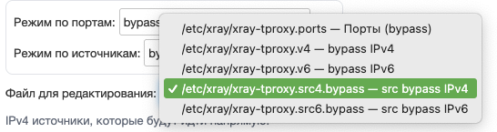
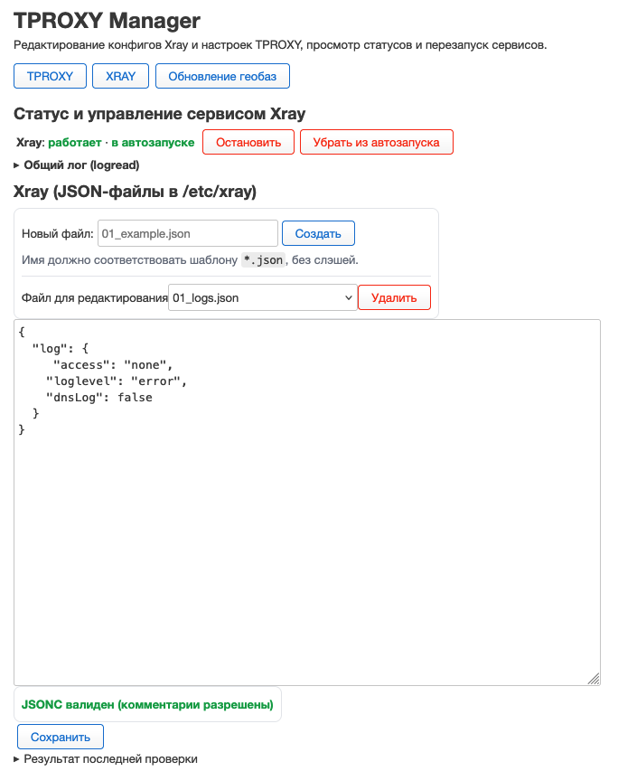
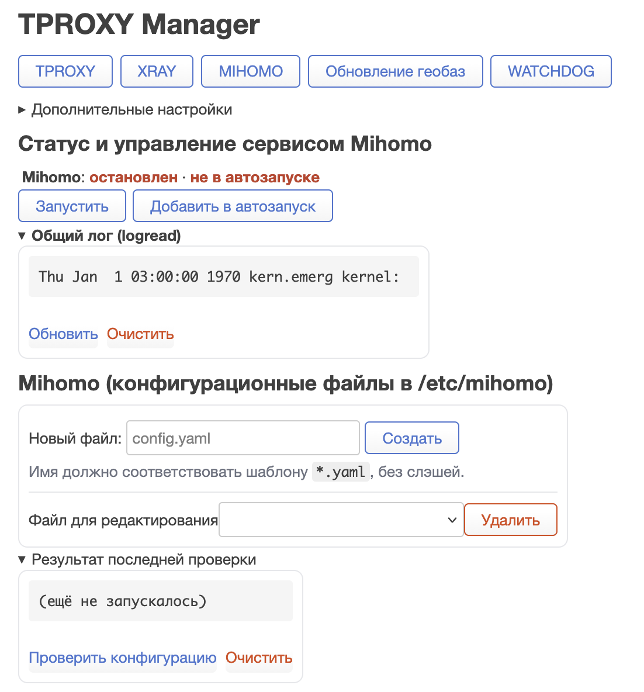
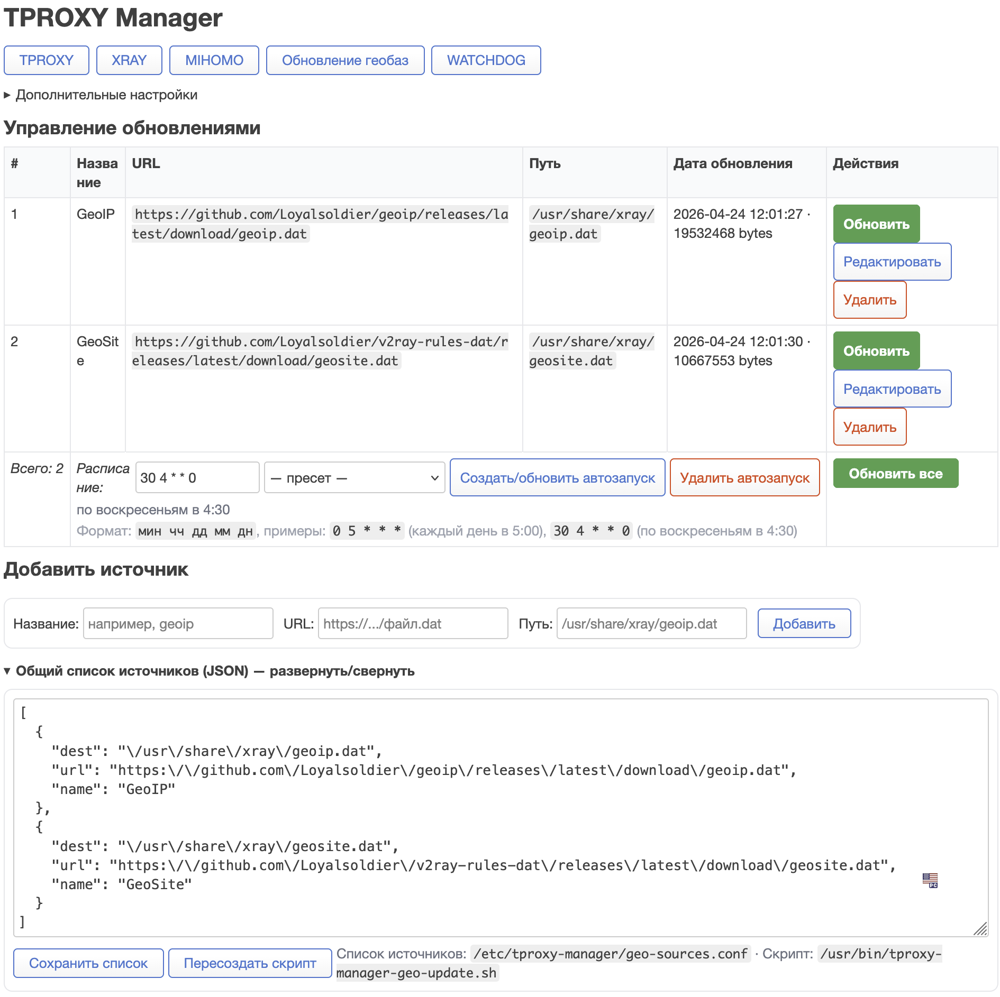
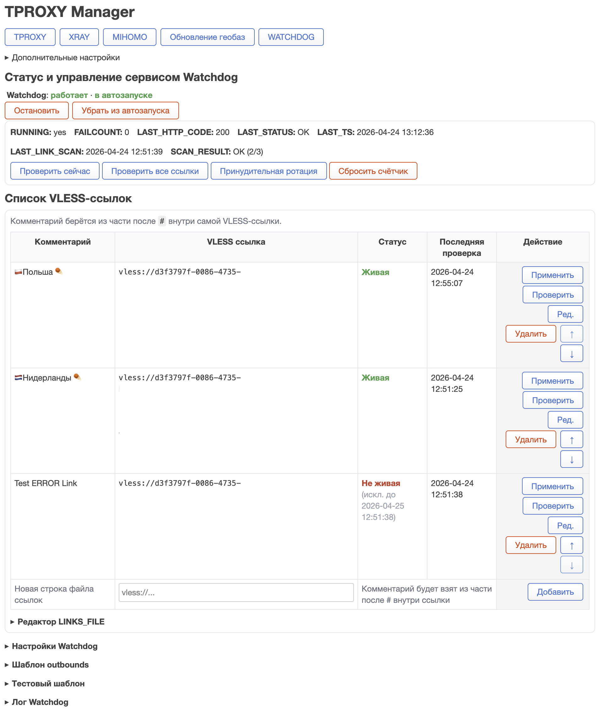

## Установка

Публичные feed-страницы публикуются на GitHub Pages:

- `24.10.x`: [https://rico-x.github.io/tproxy-manager/24.10/](https://rico-x.github.io/tproxy-manager/24.10/)
- `25.12.x`: [https://rico-x.github.io/tproxy-manager/25.12/](https://rico-x.github.io/tproxy-manager/25.12/)

### OpenWrt 24.10.x

Локальная установка:

1. Скачайте актуальный `.ipk` из [releases](https://github.com/rico-x/tproxy-manager/releases/latest).
2. Установите пакет через LuCI или `opkg install /tmp/tproxy-manager.ipk`.

Установка через feed:

```sh
wget -O /tmp/usign.pub https://rico-x.github.io/tproxy-manager/24.10/keys/usign.pub
opkg-key add /tmp/usign.pub
echo 'src/gz tproxy https://rico-x.github.io/tproxy-manager/24.10' >> /etc/opkg/customfeeds.conf
opkg update
opkg install tproxy-manager
```

Если в опубликованном feed нет `24.10/keys/usign.pub`, используйте локальную установку `.ipk`.

### OpenWrt 25.12.x

Локальная установка:

1. Скачайте актуальный `.apk` из [releases](https://github.com/rico-x/tproxy-manager/releases/latest).
2. Установите пакет командой `apk add --allow-untrusted /tmp/tproxy-manager.apk`.

Установка через feed:

```sh
wget -O /etc/apk/keys/tproxy-manager.pem https://rico-x.github.io/tproxy-manager/25.12/keys/tproxy-manager.pem
echo 'https://rico-x.github.io/tproxy-manager/25.12/packages.adb' >> /etc/apk/repositories.d/customfeeds.list
apk update
apk add tproxy-manager
```

Для `25.12.x` `opkg` больше не используется.
Если в опубликованном feed нет `25.12/keys/tproxy-manager.pem`, используйте локальную установку `.apk`.

### APK signing key

Для `apk` feed нужен отдельный EC private key на кривой NIST P-256.

В проект уже добавлен публичный ключ:

- `keys/tproxy-manager-apk.pem`

Приватный ключ в репозиторий не коммитится. Он хранится локально в:

- `keys/private/tproxy-manager-apk.key`

Сгенерировать пару можно так:

```sh
./scripts/generate-apk-key.sh
```

После генерации:

1. Оставьте в git только `keys/tproxy-manager-apk.pem`
2. Содержимое `keys/private/tproxy-manager-apk.key` сохраните в GitHub Secret `APK_PRIVATE_KEY`

Workflow проверяет, что `APK_PRIVATE_KEY` соответствует `keys/tproxy-manager-apk.pem`.

После установки `postinst`:

- запускает `uci-defaults` и создаёт базовые файлы в `/etc/tproxy-manager`;
- копирует seed-шаблоны watchdog, если их ещё нет;
- делает исполняемыми `/etc/init.d/tproxy-manager` и `/etc/init.d/tproxy-manager-watchdog`;
- включает и запускает `/etc/init.d/tproxy-manager`.

Сервис `tproxy-manager-watchdog` автоматически не включается и не стартует без явного действия пользователя.

## Что создаёт пакет

Системные сервисы:

- `/etc/init.d/tproxy-manager` — управление TPROXY-правилами.
- `/etc/init.d/tproxy-manager-watchdog` — `procd`-сервис watchdog.

Основные runtime-скрипты:

- `/usr/bin/tproxy-manager.sh`
- `/usr/bin/tproxy-manager-watchdog.sh`
- `/usr/bin/vless2json.sh`
- `/usr/bin/tproxy-manager-geo-update.sh`

Каталог пользовательских файлов:

- `/etc/tproxy-manager/tproxy-manager.ports`
- `/etc/tproxy-manager/tproxy-manager.v4`
- `/etc/tproxy-manager/tproxy-manager.v6`
- `/etc/tproxy-manager/tproxy-manager.src4.only`
- `/etc/tproxy-manager/tproxy-manager.src6.only`
- `/etc/tproxy-manager/tproxy-manager.src4.bypass`
- `/etc/tproxy-manager/tproxy-manager.src6.bypass`
- `/etc/tproxy-manager/geo-sources.conf`
- `/etc/tproxy-manager/watchdog.links`
- `/etc/tproxy-manager/watchdog-outbound.template.jsonc`
- `/etc/tproxy-manager/watchdog-test-config.template.jsonc`

UCI-конфиг:

- `/etc/config/tproxy-manager`

## Навигация по LuCI

Верхняя панель показывает базовую вкладку `TPROXY` всегда. Остальные вкладки включаются в сворачиваемом блоке `Дополнительные настройки`:

- `XRAY`
- `MIHOMO`
- `Обновление геобаз`
- `WATCHDOG`

По умолчанию `WATCHDOG` выключен.

Если на странице есть несохранённые правки в редакторах, переключение вкладок и части селекторов защищено confirm-guard.

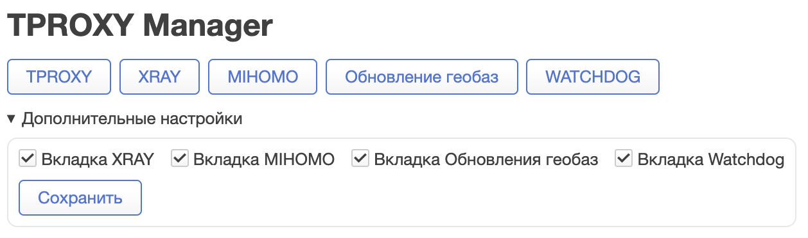

## Вкладка TPROXY

Во вкладке `TPROXY` настраиваются системные правила перехвата:

- список LAN-интерфейсов;
- IPv6;
- TPROXY-порты;
- `fwmark` и routing tables;
- режим по портам: `bypass` или `only`;
- режим по источникам: `off`, `only`, `bypass`;
- пути до файлов списков.

Единый редактор списков позволяет править любой из файлов списков без ручного перехода по SSH. Для SRC-списков есть быстрое добавление IP из DHCP-аренд.

Типовые форматы:

- порт: `80`
- диапазон: `1000-2000`
- IPv4/CIDR: `192.168.1.0/24`
- IPv6/CIDR: `2001:db8::/32`
- комментарии и пустые строки допустимы

Изменение UCI-параметров не должно восприниматься как мгновенное применение сетевых правил. Для гарантированного применения ориентируйтесь на состояние сервиса `TPROXY`.

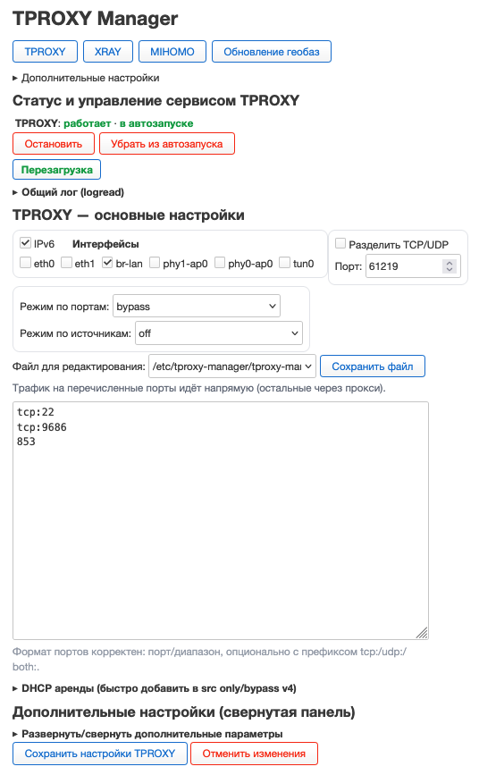

## Вкладка XRAY

Во вкладке `XRAY` доступны:

- управление сервисом `xray`;
- общий системный `logread`;
- редактор файлов `*.json` в `/etc/xray`;
- JSONC-валидация перед сохранением;
- тест всей конфигурации через `xray -test -format json -confdir /etc/xray`.

Особенности:

- новые файлы создаются только как `*.json`;
- сохранение выполняется атомарно;
- удаление выполняется для выбранного файла;
- лог результата проверки хранится в `/tmp/tproxy_manager_xray_test.log`.

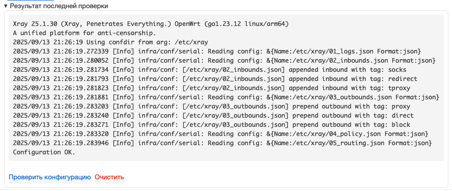

## Вкладка MIHOMO

Во вкладке `MIHOMO` доступны:

- управление сервисом `mihomo`;
- общий `logread`;
- редактор файлов `*.yaml` в `/etc/mihomo`;
- проверка выбранного конфига через `mihomo -t -f /etc/mihomo/<file>`.

Особенности:

- создаются только файлы `*.yaml`;
- сохранение конфигурации не валидирует YAML до записи;
- результат последней проверки хранится в `/tmp/tproxy_manager_mihomo_test.log`.

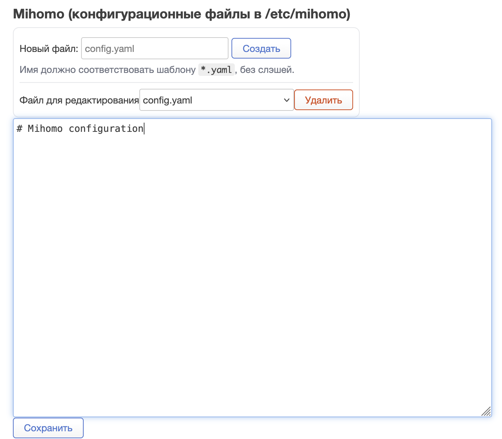

## Вкладка Обновление геобаз

Модуль GEO работает с файлом `/etc/tproxy-manager/geo-sources.conf` и генерирует системный скрипт `/usr/bin/tproxy-manager-geo-update.sh`.

Во вкладке доступны:

- таблица источников `name / url / dest`;
- добавление, редактирование и удаление строк;
- обновление одной записи;
- обновление всех источников;
- настройка cron-расписания;
- глобальный JSON/JSONC-редактор списка источников;
- пересоздание updater-скрипта.

Технические детали:

- cron-тег: `# tproxy-manager-geo-update`
- syslog-тег: `tproxy-manager-geoip-update`
- для скачивания используется `curl`, при необходимости fallback на `wget`


## Вкладка WATCHDOG

`WATCHDOG` — отдельный модуль и отдельный сервис, который проверяет текущий прокси, при достижении порога ошибок выбирает рабочую VLESS-ссылку, генерирует новый outbound через встроенный `vless2json.sh` и перезапускает выбранный сервис.

Сервис:

- `/etc/init.d/tproxy-manager-watchdog`
- runtime: `/usr/bin/tproxy-manager-watchdog.sh`

Вкладка по умолчанию выключена и включается в `Дополнительных настройках`.


### Что делает Watchdog

Основной цикл:

1. Проверяет `CHECK_URL` через локальный `PROXY_URL`.
2. Если текущий прокси отвечает, watchdog просто обновляет состояние.
3. Если ошибок подряд становится не меньше `FAIL_THRESHOLD`, watchdog начинает ротацию ссылок.
4. Для каждой кандидатной ссылки он поднимает отдельный test-instance через `TEST_COMMAND`.
5. Рабочая ссылка применяется в `OUTBOUND_FILE`, затем вызывается `SERVICE_PATH restart`.

Режимы автоматического выбора:

- `по порядку`
- `случайно`

Есть опция временно исключать нерабочие ссылки на заданное время.

### LINKS_FILE и таблица ссылок

Основной список хранится в `watchdog.links`.

Поддерживаемый формат строки:

```txt
vless://...#Комментарий
```

или

```txt
vless://... # внешний комментарий
```

Сейчас UI ориентирован на комментарий из `#fragment` внутри самой ссылки. В таблице показывается:

- комментарий;
- сама ссылка без комментария;
- статус `Живая / Не живая / Не проверялась`;
- время последней проверки;
- действия `Применить / Проверить / Ред. / Удалить / Вверх / Вниз`.

Под таблицей находится сворачиваемый массовый редактор `LINKS_FILE` для вставки большого числа ссылок сразу.

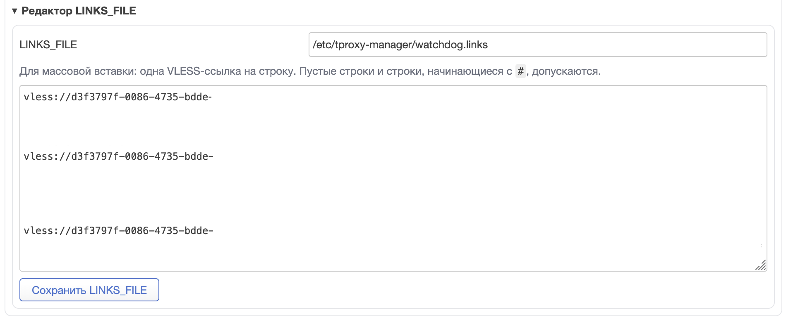

### Outbounds-шаблон

Watchdog не хранит outbound-шаблон внутри shell-скрипта. Он работает с отдельным файлом:

- `watchdog_template_file`
- по умолчанию: `/etc/tproxy-manager/watchdog-outbound.template.jsonc`

Этот шаблон редактируется прямо из вкладки и передаётся встроенному конвертеру по умолчанию:

```sh
vless2json.sh -r LINKS_FILE -t TEMPLATE_FILE
```

В проект уже встроен `/usr/bin/vless2json.sh`, поэтому пакет самодостаточен. При необходимости путь до конвертера можно переопределить в `WATCHDOG`.

Поведение встроенного конвертера:

- на вход получает файл со ссылками и путь до шаблона;
- использует первую валидную VLESS-ссылку из файла;
- на выход отдаёт JSON-объект, полученный из шаблона;
- внутри этого объекта должен быть корректный `outbounds`-массив для выбранной ссылки.

Описание плейсхолдеров и контракт шаблона вынесены в [docs/vless2json.md](docs/vless2json.md).

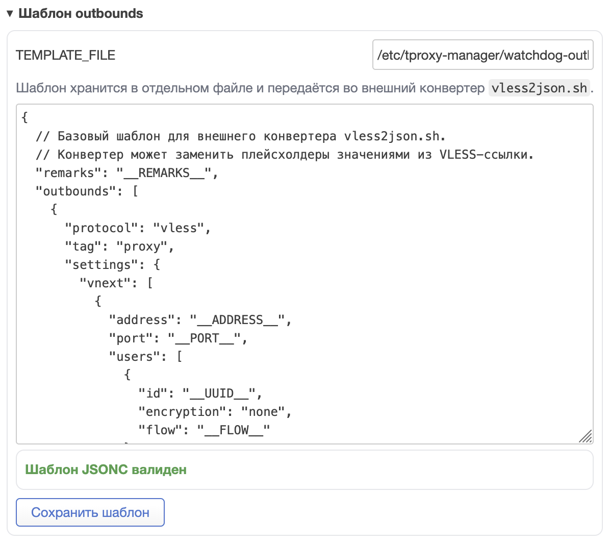

### Тестовый шаблон

Для test-instance используется отдельный шаблон:

- `watchdog_test_template_file`
- по умолчанию: `/etc/tproxy-manager/watchdog-test-config.template.jsonc`

Это нужно для случаев, когда для тестирования используется не штатный Xray-конфиг или вообще другой движок. Шаблон редактируется прямо во вкладке.

Базовые плейсхолдеры test-шаблона:

- `__TEST_PORT__` — локальный порт временного SOCKS-inbound;
- `__OUTBOUNDS__` — массив outbounds, полученный из конвертера;
- `__OUTBOUND_TAG__` — `tag` первого outbound из этого массива.

`__OUTBOUND_TAG__` нужен, чтобы test-instance направил свой inbound именно в целевой outbound при проверке, а не в `direct` или `block`.

По умолчанию команда тестового запуска:

```sh
/usr/bin/xray -c {config}
```

Но она настраивается через `watchdog_test_command`. Если используется другой движок, правятся и `TEST_COMMAND`, и test-template.

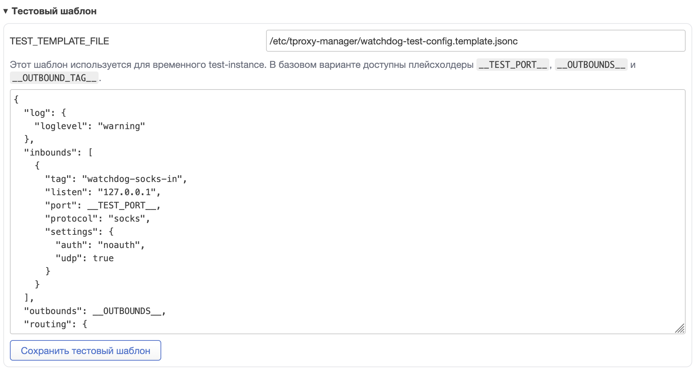

### Настройки Watchdog

Основные параметры:

- `CHECK_URL`
- `PROXY_URL`
- `INTERVAL`
- `FAIL_THRESHOLD`
- `CONNECT_TIMEOUT`
- `MAX_TIME`
- `OUTBOUND_FILE`
- `VLESS2JSON`
- `SERVICE_PATH`
- `TEST_COMMAND`
- `SELECTION_MODE`
- `TEST_PORT`

`RESTART_CMD` намеренно фиксирован как `restart`, а путь до обслуживаемого сервиса задаётся отдельно через `SERVICE_PATH`. Это сделано, чтобы поддерживать не только `xray`, но и другие сервисы.

Также есть:

- фоновая проверка всех ссылок по таймеру;
- настраиваемый таймер в секундах;
- отображение времени последней массовой проверки и результата `alive/total`.

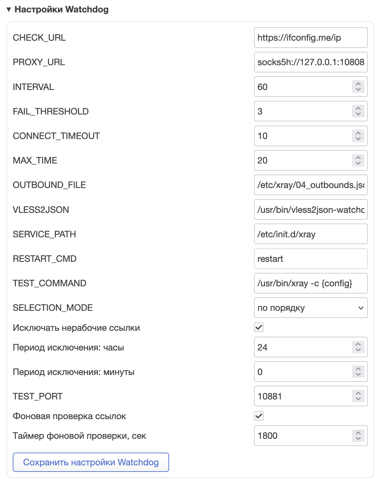

### Логи и runtime-state

Основной лог watchdog:

- `/tmp/tproxy-manager-watchdog.log`

Runtime-state:

- `/tmp/tproxy-manager-watchdog.state`
- per-link state: `/tmp/tproxy-manager-watchdog-links/*.state`

Из UI доступны:

- очистка лога;
- ручная проверка текущего прокси;
- ручная проверка всех ссылок;
- принудительная ротация;
- сброс счётчика ошибок.

## Быстрый список полезных путей

| Назначение | Путь |
| --- | --- |
| UCI-конфиг | `/etc/config/tproxy-manager` |
| Основной TPROXY-скрипт | `/usr/bin/tproxy-manager.sh` |
| TPROXY init.d | `/etc/init.d/tproxy-manager` |
| Watchdog runtime | `/usr/bin/tproxy-manager-watchdog.sh` |
| Встроенный VLESS-конвертер | `/usr/bin/vless2json.sh` |
| Watchdog init.d | `/etc/init.d/tproxy-manager-watchdog` |
| GEO updater | `/usr/bin/tproxy-manager-geo-update.sh` |
| Каталог списков и шаблонов | `/etc/tproxy-manager` |
| Xray configs | `/etc/xray` |
| Mihomo configs | `/etc/mihomo` |
| OpenWrt source-package | `openwrt-feed/net/tproxy-manager/Makefile` |

## Сборка пакета

Пакет теперь собирается как штатный OpenWrt source-package из:

- `openwrt-feed/net/tproxy-manager/Makefile`
- `openwrt-feed/net/tproxy-manager/files/`

Ручная сборка через `ipkg-build` и каталог `pkg/tproxy-manager-ipk/CONTROL/*` больше не являются основной схемой публикации. CI собирает пакет через OpenWrt SDK:

- `24.10.6` -> `.ipk` + `Packages.gz`
- `25.12.2` -> `.apk` + `packages.adb`

Обычные push в `main` собирают feed и Pages-артефакты. GitHub Release создаётся только для тегов `vYY.M.D` или ручного запуска workflow с указанным тегом.

## Типовые сценарии

### Включить Watchdog

1. В LuCI откройте `TPROXY Manager`.
2. В `Дополнительных настройках` включите вкладку `WATCHDOG`.
3. Откройте `WATCHDOG`.
4. Заполните `LINKS_FILE`, путь до конвертера и путь до обслуживаемого сервиса.
5. При необходимости скорректируйте outbound-шаблон и test-template.
6. Сохраните настройки.
7. Проверьте ссылки кнопкой `Проверить все ссылки`.
8. После этого включите и запустите сервис `Watchdog`.

### Использовать Watchdog не с Xray

Нужно отдельно проверить три вещи:

1. Конвертер действительно генерирует формат, который понимает ваш потребитель.
2. `SERVICE_PATH restart` перезапускает правильный сервис.
3. `TEST_COMMAND` и test-template подходят именно под ваш тестовый engine.

## Диагностика

Если что-то не работает:

1. Проверьте `logread`.
2. Проверьте логи watchdog: `/tmp/tproxy-manager-watchdog.log`.
3. Проверьте состояние watchdog:

```sh
/usr/bin/tproxy-manager-watchdog.sh status
```

4. Проверьте ручной health-check ссылок:

```sh
/usr/bin/tproxy-manager-watchdog.sh check-all
```

5. Проверьте TPROXY:

```sh
/etc/init.d/tproxy-manager status
/etc/init.d/tproxy-manager diag
```
