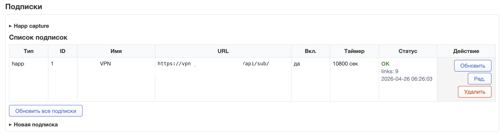
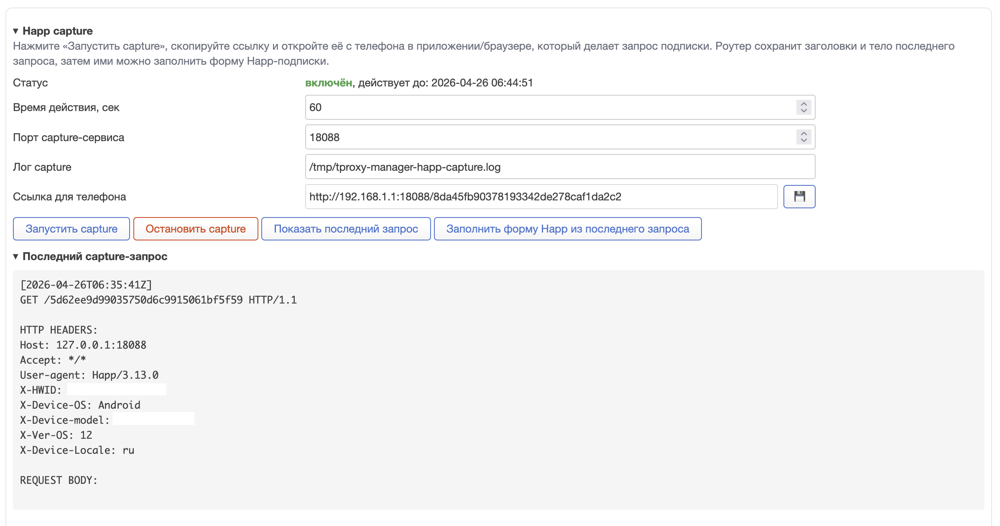

> [!IMPORTANT]
> **Disclaimer.** TPROXY Manager is not a tool for bypassing restrictions, hiding user activity, or violating access rules for information resources. The author does not support using this software to violate the laws of any country. The project is intended for local router administration: controlled traffic routing, transparent traffic handling, network load optimization, and maintenance of user-owned proxy services in lawful scenarios.

# TPROXY Manager for OpenWrt

[Русская версия](README.md)


TPROXY Manager is a LuCI panel and a set of OpenWrt system scripts. It manages transparent traffic interception through `nftables`, routing lists, Xray/Mihomo configuration files, GEO databases, VLESS subscriptions, and automatic outbound rotation through Watchdog.

The package is designed for routers where the proxy daemon is installed separately. The managed service can be Xray, Mihomo, sing-box, or another daemon that can consume generated config fragments and link lists.

Main features:

- TPROXY rules and policy routing management from LuCI.
- Port, address, and source traffic list editors.
- Xray and Mihomo service controls.
- JSON/JSONC and YAML editors with server-side validation before saving.
- Configurable `geoip.dat` and `geosite.dat` download sources.
- Cron-based GEO database updates.
- Built-in `/usr/bin/vless2json.sh` converter for VLESS links.
- Watchdog for subscriptions, batch link checks, dead-link exclusion, and automatic rotation.
- Happ subscriptions with regular `https://` URLs, encrypted `happ://crypt*` URLs, and Xray-like JSON responses.
- Batch VLESS checks through one test instance with separate outbound tags and SOCKS ports.
- Active-link selection modes: ordered, random, and fastest.
- Fast package builds without the OpenWrt SDK: `.ipk` for OpenWrt 24.10 and `.apk` for OpenWrt 25.12.

Low-level TPROXY engine reference: [docs/en/tproxy-doc.md](docs/en/tproxy-doc.md).  
Built-in VLESS converter reference: [docs/en/vless2json.md](docs/en/vless2json.md).

## Installation

Package feeds are published on GitHub Pages:

- OpenWrt 24.10: [https://rico-x.github.io/tproxy-manager/24.10/](https://rico-x.github.io/tproxy-manager/24.10/)
- OpenWrt 25.12: [https://rico-x.github.io/tproxy-manager/25.12/](https://rico-x.github.io/tproxy-manager/25.12/)

After installation, open LuCI: `Network -> TPROXY Manager`.

Check your OpenWrt version first:

```sh
cat /etc/openwrt_release
```

Use the package format that matches your OpenWrt branch:

| OpenWrt version | Package manager | Package format | Feed |
| --- | --- | --- | --- |
| `24.10.x` and older | `opkg` | `.ipk` | `/24.10/` |
| `25.12.x` and newer | `apk` | `.apk` | `/25.12/` |

Do not mix the commands. OpenWrt 25.12 uses `apk`, so `opkg` instructions do not apply. OpenWrt 24.10 uses `opkg`, so `apk add` is usually unavailable there.

### OpenWrt 24.10.x

For local installation, download the `.ipk` from the [latest release](https://github.com/rico-x/tproxy-manager/releases/latest) and install it:

```sh
opkg install /tmp/tproxy-manager.ipk
```

For feed installation:

```sh
wget -O /tmp/usign.pub https://rico-x.github.io/tproxy-manager/24.10/keys/usign.pub
opkg-key add /tmp/usign.pub
echo 'src/gz tproxy https://rico-x.github.io/tproxy-manager/24.10' >> /etc/opkg/customfeeds.conf
opkg update
opkg install tproxy-manager
```

### OpenWrt 25.12.x

For local installation, download the `.apk` from the [latest release](https://github.com/rico-x/tproxy-manager/releases/latest) and install it:

```sh
apk add --allow-untrusted /tmp/tproxy-manager.apk
```

For feed installation:

```sh
wget -O /etc/apk/keys/tproxy-manager.pem https://rico-x.github.io/tproxy-manager/25.12/keys/tproxy-manager.pem
echo 'https://rico-x.github.io/tproxy-manager/25.12/packages.adb' > /etc/apk/repositories.d/customfeeds.list
apk update
apk add tproxy-manager
```

If the feed key is already installed, updating is enough:

```sh
apk update
apk upgrade tproxy-manager
```

### What post-install does

The package post-install script:

- Runs `/etc/uci-defaults/90_tproxy_manager`.
- Creates `/etc/tproxy-manager`.
- Creates `/usr/share/tproxy-manager`.
- Creates default list files.
- Creates the Watchdog subscription database.
- Creates `/etc/tproxy-manager/geo-sources.conf` if it is missing or empty.
- Copies Watchdog templates to `/etc/tproxy-manager` if they do not exist.
- Marks init scripts and `/usr/bin/vless2json.sh` executable.
- Enables and starts `/etc/init.d/tproxy-manager`.
- Does not enable or start Watchdog unless the user explicitly does it.

The default GEO source file contains:

```json
[
  {
    "dest": "/usr/share/tproxy-manager/geoip.dat",
    "url": "https://github.com/Loyalsoldier/geoip/releases/latest/download/geoip.dat",
    "name": "GeoIP"
  },
  {
    "dest": "/usr/share/tproxy-manager/geosite.dat",
    "url": "https://github.com/Loyalsoldier/v2ray-rules-dat/releases/latest/download/geosite.dat",
    "name": "GeoSite"
  }
]
```

After installation, point your proxy daemon to `/usr/share/tproxy-manager/` as its GEO data directory. For Xray with an UCI wrapper:

```sh
uci set xray.config.datadir='/usr/share/tproxy-manager/'
uci commit xray
/etc/init.d/xray restart
```

If your Xray installation has no UCI wrapper, configure an equivalent `datadir` in the daemon config or init script.

## LuCI Tabs


The `TPROXY` tab is always available. Additional tabs are enabled from the collapsible `Additional settings` panel.

Available tabs:

- `TPROXY`
- `XRAY`
- `MIHOMO`
- `GEO updates`
- `WATCHDOG`

`WATCHDOG` is disabled by default.

If an editor contains unsaved changes, the UI warns before switching tabs.

## TPROXY


The `TPROXY` tab controls transparent traffic interception and routing lists.

It configures:

- LAN interfaces that feed intercepted traffic.
- IPv6 support.
- A common TPROXY port or separate TCP/UDP ports.
- TCP and UDP `fwmark`.
- TCP and UDP routing table IDs.
- Port mode: `bypass` or `only`.
- Source mode: `off`, `only`, or `bypass`.
- Paths to list files.

The default `nftables` table is `tp_mgr`.

Main list files:

- `/etc/tproxy-manager/tproxy-manager.ports`
- `/etc/tproxy-manager/tproxy-manager.v4`
- `/etc/tproxy-manager/tproxy-manager.v6`
- `/etc/tproxy-manager/tproxy-manager.src4.only`
- `/etc/tproxy-manager/tproxy-manager.src6.only`
- `/etc/tproxy-manager/tproxy-manager.src4.bypass`
- `/etc/tproxy-manager/tproxy-manager.src6.bypass`

The embedded editor can modify these files directly from LuCI. Source lists also support quick IP insertion from active DHCP leases.

## XRAY


The `XRAY` tab provides basic Xray maintenance:

- Start, stop, restart, and autostart controls for the `xray` service.
- Shared `logread` viewer.
- `*.json` editor for `/etc/xray`.
- File creation and deletion.
- JSONC validation before saving.
- Full configuration validation through `xray -test -format json -confdir /etc/xray`.

## MIHOMO


The `MIHOMO` tab works with YAML configs in `/etc/mihomo`.

It provides:

- Service controls for `mihomo`.
- YAML editor.
- File creation and deletion.
- Syntax validation through the existing `mihomo` binary before saving.

## GEO Updates


The GEO module manages:

- `/etc/tproxy-manager/geo-sources.conf`
- `/usr/bin/tproxy-manager-geo-update.sh`
- Optional cron schedule for automatic updates.

Each source contains:

- `name`
- `url`
- `dest`

Invalid JSON/JSONC is rejected server-side and never overwrites the existing source list with an empty config.

After the first update, make sure the proxy daemon uses `/usr/share/tproxy-manager/` as its GEO directory.

## WATCHDOG


Watchdog is a separate LuCI tab and a separate OpenWrt service:

- `/etc/init.d/tproxy-manager-watchdog`
- `/usr/bin/tproxy-manager-watchdog.sh`
- `/usr/bin/tproxy-manager-subscriptions.lua`

It checks the active proxy through `CHECK_URL`. If the check fails repeatedly, Watchdog selects another VLESS link, probes it with a test instance, generates an outbound config, and restarts the configured managed service.

The status line shows:

- service state;
- failure counter;
- last HTTP code;
- last check status;
- last check timestamp;
- active subscription/source when the current config matches a known link.

### Subscriptions



Watchdog can update the proxy list from subscriptions while preserving local links.

Supported subscription behavior:

- Happ subscriptions can use a regular `https://` URL or an encrypted `happ://crypt*` URL.
- Raw text responses are scanned for `vless://` links.
- Base64 responses are decoded and scanned.
- Xray-like JSON responses are parsed and VLESS outbounds are converted to normal `vless://` links.

Each subscription has its own refresh timer. When a subscription changes, Watchdog updates the subscription database and synchronizes the final `watchdog.links` file. Local links are not removed.

Source labels in the link table:

- `local`: manually added link.
- `happ N`: link from Happ subscription `N`.

Subscription links are not edited directly. They can be checked, applied, excluded from rotation, moved, or restored.

### Happ Capture



`Happ capture` is inside the shared collapsible `Happ` block. It is used to capture the real HTTP headers sent by a phone or client when requesting a subscription.

Workflow:

1. Open the `Happ` block.
2. Start capture.
3. Copy the phone link.
4. Open it on the phone in the app or browser that performs the subscription request.
5. Return to LuCI and show the last request if needed.
6. Fill the Happ form from the last request.

Capture is enabled only for a limited time. TTL, port, and log path are configured on the Watchdog tab.

### Happ Decrypt

`Happ decrypt` is in the same `Happ` block.

It decrypts:

- `happ://crypt/`
- `crypt2`
- `crypt3`
- `crypt4`
- `crypt5`

The result is displayed as plain text only. It is not added automatically to subscriptions, `watchdog.links`, or UCI because the decrypted payload may be an `https` URL, a `vless` link, JSON, or any other text.

### Link Checks And Rotation


`Check all links` uses batch mode: Watchdog creates one temporary test config for a chunk of links. Every link receives a unique outbound tag and a dedicated local SOCKS inbound, then `curl` checks `CHECK_URL` through the corresponding port.

Per-link state stores:

- `OK` or `Error`;
- last HTTP code;
- last check time;
- request time in milliseconds;
- cooldown state for dead links;
- source label and active marker.

Selection modes:

- `ordered`: cyclic order based on `watchdog.links`.
- `random`: randomized candidate order.
- `fastest`: uses alive links sorted by saved request time, with ordered fallback when no speed data exists.

For `fastest`, enable background link checks or run `Check all links` periodically so Watchdog has fresh request-time data.

### Templates


Watchdog does not embed the outbound JSON in the shell script. It uses external templates:

- `/etc/tproxy-manager/watchdog-outbound.template.jsonc`
- `/etc/tproxy-manager/watchdog-test-config.template.jsonc`
- `/etc/tproxy-manager/watchdog-batch-test-config.template.jsonc`

The default converter is:

```sh
/usr/bin/vless2json.sh
```

Template placeholders are documented in [docs/en/vless2json.md](docs/en/vless2json.md).

## Useful Paths

| Component | Path |
| --- | --- |
| Main init.d | `/etc/init.d/tproxy-manager` |
| Main runtime | `/usr/bin/tproxy-manager.sh` |
| LuCI model | `/usr/lib/lua/luci/model/cbi/tproxy_manager/manage.lua` |
| Watchdog init.d | `/etc/init.d/tproxy-manager-watchdog` |
| Watchdog runtime | `/usr/bin/tproxy-manager-watchdog.sh` |
| Watchdog subscriptions | `/usr/bin/tproxy-manager-subscriptions.lua` |
| Watchdog libs | `/usr/libexec/tproxy-manager/watchdog/*` |
| VLESS converter | `/usr/bin/vless2json.sh` |
| GEO updater | `/usr/bin/tproxy-manager-geo-update.sh` |
| Main config | `/etc/config/tproxy-manager` |
| Watchdog links | `/etc/tproxy-manager/watchdog.links` |
| Watchdog subscriptions DB | `/etc/tproxy-manager/watchdog-subscriptions.json` |
| GEO data directory | `/usr/share/tproxy-manager` |

## Build

The project builds packages without the OpenWrt SDK. The repository keeps separate fast builders for `.ipk` and `.apk`.

Build only `.ipk`:

```sh
./scripts/build-ipk.sh pkg/tproxy-manager dist/24.10 2026.01.01-1 ./ipkg-build
```

Build only `.apk`:

```sh
./scripts/build-apk.sh pkg/tproxy-manager dist/25.12 2026.01.01-r1 ./.apk-tools/apk.static
```

The build also compiles the bundled Russian LuCI translation catalog into:

```txt
/usr/lib/lua/luci/i18n/tproxy-manager.ru.lmo
```

## Post-Install Recommendations

### Update GEO databases

Open the GEO Updates tab and run `Update all`, or use:

```sh
/usr/bin/tproxy-manager-geo-update.sh run
```

Then configure your proxy daemon to use `/usr/share/tproxy-manager/`.

### Enable Watchdog gradually

Start with:

1. Add VLESS links or a Happ subscription.
2. Run `Check all links`.
3. Apply one known-good link.
4. Enable Watchdog service.
5. Enable background checks if `fastest` mode is used.

### Run optional tuning scripts

The package includes:

```sh
/usr/bin/optimize-sysctl.sh
/usr/bin/setup-bbr.sh
```

`postinst` runs them once and does not fail package installation if they cannot apply every setting. After kernel upgrades, firmware changes, or manual sysctl edits, you can run them again:

```sh
/usr/bin/optimize-sysctl.sh
/usr/bin/setup-bbr.sh
```

`optimize-sysctl.sh` writes supported values to `/etc/sysctl.d/66-tproxy-manager.conf`.  
`setup-bbr.sh` enables TCP BBR when the kernel and `kmod-tcp-bbr` support it.

### Protect DNS from leaks

To avoid exposing DNS queries through the ISP resolver, install HTTPS DNS proxy packages:

```sh
opkg update
opkg install https-dns-proxy luci-app-https-dns-proxy luci-i18n-https-dns-proxy-ru
```

On OpenWrt 25.12:

```sh
apk update
apk add https-dns-proxy luci-app-https-dns-proxy luci-i18n-https-dns-proxy-ru
```

After installation, configure a DNS-over-HTTPS provider in LuCI and make sure LAN clients use the router as their DNS server.

## Diagnostics

Main service:

```sh
/etc/init.d/tproxy-manager status
/etc/init.d/tproxy-manager diag
logread | grep -i tproxy
```

Watchdog:

```sh
/usr/bin/tproxy-manager-watchdog.sh status
/usr/bin/tproxy-manager-watchdog.sh check-all
logread | grep -i watchdog
```

Package files:

```sh
opkg files tproxy-manager
apk info -L tproxy-manager
```
