> [!IMPORTANT]
> **Disclaimer.** TPROXY Manager is not a tool for bypassing restrictions, hiding user activity, or violating access rules for information resources. The author does not support using this software to violate the laws of any country. The project is intended for local router administration: controlled traffic routing, transparent traffic handling, network load optimization, and maintenance of user-owned proxy services in lawful scenarios.

# TPROXY Manager for OpenWrt

[Русская версия](README.md)

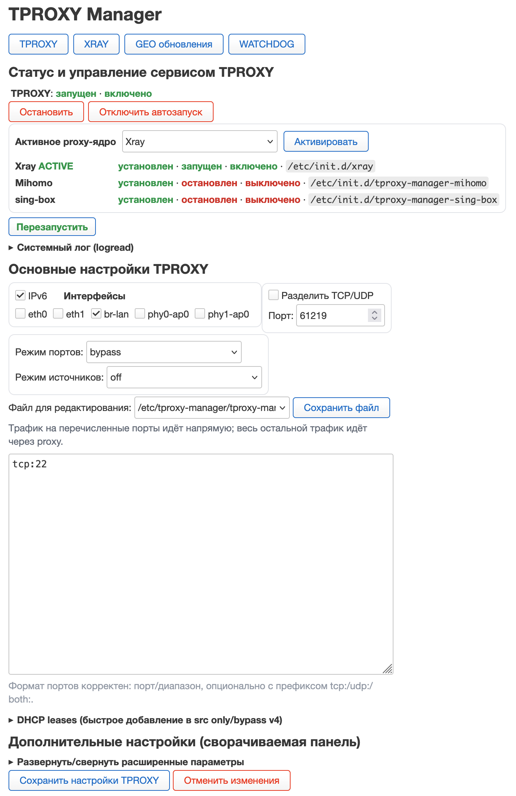

TPROXY Manager is a LuCI panel and a set of OpenWrt system scripts. It manages transparent traffic interception through `nftables`, routing lists, Xray/Mihomo/sing-box configuration files, GEO databases, proxy subscriptions, and automatic outbound rotation through Watchdog.

The package is designed for routers where the proxy daemon is installed separately. Three managed engines are supported: Xray, Mihomo, and sing-box. The user selects the active engine on the `TPROXY` tab, and the project applies the matching Watchdog profile while stopping inactive daemons to avoid port conflicts.

Main features:

- TPROXY rules and policy routing management from LuCI.
- Port, address, and source traffic list editors.
- Active proxy engine selection: Xray, Mihomo, or sing-box.
- Service controls for the active engine.
- JSON/JSONC and YAML editors with server-side validation before saving.
- Configurable `geoip.dat` and `geosite.dat` download sources.
- Cron-based GEO database updates.
- Built-in converters for generating Xray, Mihomo, and sing-box configs from VLESS and Hysteria 2 links.
- Watchdog for subscriptions, batch link checks, dead-link exclusion, and automatic rotation.
- Router-side subscription sharing for v2RayTun, Happ, Shadowrocket, v2Box, and V2rayNG clients.
- Happ subscriptions with regular `https://` URLs, encrypted `happ://crypt*` URLs, and Xray-like JSON responses.
- Batch proxy checks through one test instance with separate outbound tags and SOCKS ports.
- Active-link selection modes: ordered, random, and fastest.
- Fast package builds without the OpenWrt SDK: `.ipk` for OpenWrt 24.10 and `.apk` for OpenWrt 25.12.

Low-level TPROXY engine reference: [docs/en/tproxy-doc.md](docs/en/tproxy-doc.md).  
Built-in link converter reference: [docs/en/vless2json.md](docs/en/vless2json.md).

## Installation

Package feeds are published on GitHub Pages:

- OpenWrt 24.10: [https://rico-x.github.io/tproxy-manager/24.10/](https://rico-x.github.io/tproxy-manager/24.10/)
- OpenWrt 25.12: [https://rico-x.github.io/tproxy-manager/25.12/](https://rico-x.github.io/tproxy-manager/25.12/)

After installation, open LuCI: `Network -> TPROXY Manager`.

Check your OpenWrt version first:

```sh
cat /etc/openwrt_release
```

Use the package format that matches your OpenWrt branch:

| OpenWrt version | Package manager | Package format | Feed |
| --- | --- | --- | --- |
| `24.10.x` and older | `opkg` | `.ipk` | `/24.10/` |
| `25.12.x` and newer | `apk` | `.apk` | `/25.12/` |

Do not mix the commands. OpenWrt 25.12 uses `apk`, so `opkg` instructions do not apply. OpenWrt 24.10 uses `opkg`, so `apk add` is usually unavailable there.

### OpenWrt 24.10.x

For local installation, download the `.ipk` from the [latest release](https://github.com/rico-x/tproxy-manager/releases/latest) and install it:

```sh
opkg install /tmp/tproxy-manager.ipk
```

For feed installation:

```sh
wget -O /tmp/usign.pub https://rico-x.github.io/tproxy-manager/24.10/keys/usign.pub
opkg-key add /tmp/usign.pub
echo 'src/gz tproxy https://rico-x.github.io/tproxy-manager/24.10' >> /etc/opkg/customfeeds.conf
opkg update
opkg install tproxy-manager
```

### OpenWrt 25.12.x

For local installation, download the `.apk` from the [latest release](https://github.com/rico-x/tproxy-manager/releases/latest) and install it:

```sh
apk add --allow-untrusted /tmp/tproxy-manager.apk
```

For feed installation:

```sh
wget -O /etc/apk/keys/tproxy-manager.pem https://rico-x.github.io/tproxy-manager/25.12/keys/tproxy-manager.pem
echo 'https://rico-x.github.io/tproxy-manager/25.12/packages.adb' > /etc/apk/repositories.d/customfeeds.list
apk update
apk add tproxy-manager
```

If the feed key is already installed, updating is enough:

```sh
apk update
apk upgrade tproxy-manager
```

### What post-install does

The package post-install script:

- Runs `/etc/uci-defaults/90_tproxy_manager`.
- Creates `/etc/tproxy-manager`.
- Creates `/usr/share/tproxy-manager`.
- Creates default list files.
- Creates the Watchdog subscription database.
- Creates the Watchdog shared subscription profile.
- Creates `/etc/tproxy-manager/geo-sources.conf` if it is missing or empty.
- Copies Watchdog templates to `/etc/tproxy-manager` if they do not exist.
- Marks init scripts and helper scripts in `/usr/bin` executable.
- Enables and starts `/etc/init.d/tproxy-manager`.
- Does not enable or start Watchdog unless the user explicitly does it.

The default GEO source file contains:

```json
[
  {
    "dest": "/usr/share/tproxy-manager/geoip.dat",
    "url": "https://github.com/Loyalsoldier/geoip/releases/latest/download/geoip.dat",
    "name": "GeoIP"
  },
  {
    "dest": "/usr/share/tproxy-manager/geosite.dat",
    "url": "https://github.com/Loyalsoldier/v2ray-rules-dat/releases/latest/download/geosite.dat",
    "name": "GeoSite"
  }
]
```

After installation, point your proxy daemon to `/usr/share/tproxy-manager/` as its GEO data directory. For Xray with an UCI wrapper:

```sh
uci set xray.config.datadir='/usr/share/tproxy-manager/'
uci commit xray
/etc/init.d/xray restart
```

If your Xray installation has no UCI wrapper, configure an equivalent `datadir` in the daemon config or init script.

## LuCI Tabs

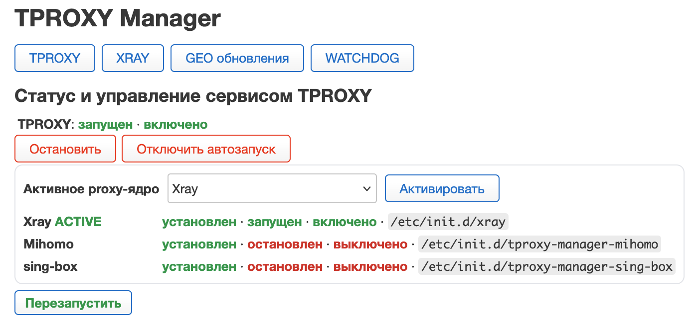

The `TPROXY`, `GEO updates`, and `WATCHDOG` tabs are always available. The active proxy engine tab is selected on the `TPROXY` tab through the `Active proxy engine` block.

Available tabs:

- `TPROXY`
- `XRAY` when Xray is active
- `MIHOMO` when Mihomo is active
- `SING-BOX` when sing-box is active
- `GEO updates`
- `WATCHDOG`

The default active engine is Xray. The Watchdog service is not started by default until the user enables it explicitly.

If an editor contains unsaved changes, the UI warns before switching tabs.

## TPROXY


The `TPROXY` tab controls transparent traffic interception and routing lists.

It configures:

- Active proxy engine: Xray, Mihomo, or sing-box.
- LAN interfaces that feed intercepted traffic.
- IPv6 support.
- A common TPROXY port or separate TCP/UDP ports.
- TCP and UDP `fwmark`.
- TCP and UDP routing table IDs.
- Port mode: `bypass` or `only`.
- Source mode: `off`, `only`, or `bypass`.
- Paths to list files.

The default `nftables` table is `tp_mgr`.

Main list files:

- `/etc/tproxy-manager/tproxy-manager.ports`
- `/etc/tproxy-manager/tproxy-manager.v4`
- `/etc/tproxy-manager/tproxy-manager.v6`
- `/etc/tproxy-manager/tproxy-manager.src4.only`
- `/etc/tproxy-manager/tproxy-manager.src6.only`
- `/etc/tproxy-manager/tproxy-manager.src4.bypass`
- `/etc/tproxy-manager/tproxy-manager.src6.bypass`

The embedded editor can modify these files directly from LuCI. Source lists also support quick IP insertion from active DHCP leases.

The `Active proxy engine` block shows the state of all three daemons: installed/not installed, running/stopped, and autostart enabled/disabled. Activating an engine saves the current engine profile, applies the selected profile to TPROXY and Watchdog, stops the two inactive proxy daemons, starts the selected daemon if its binary exists, and restarts `tproxy-manager` / `tproxy-manager-watchdog`.

## XRAY

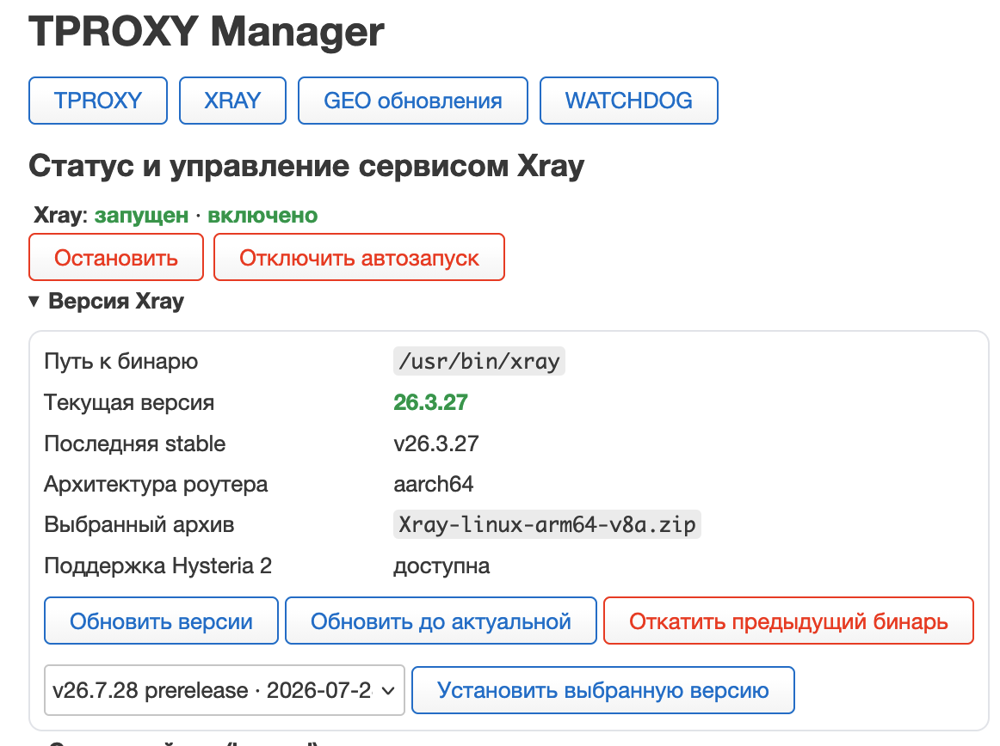

The `XRAY` tab provides basic Xray maintenance:

- Start, stop, restart, and autostart controls for the `xray` service.
- Shared `logread` viewer.
- `*.json` editor for `/etc/xray`.
- File creation and deletion.
- JSONC validation before saving.
- Full configuration validation through `xray -test -format json -confdir /etc/xray`.
- Xray version view with the current binary version, latest stable GitHub release, router architecture asset, one-click update, and rollback.

## MIHOMO

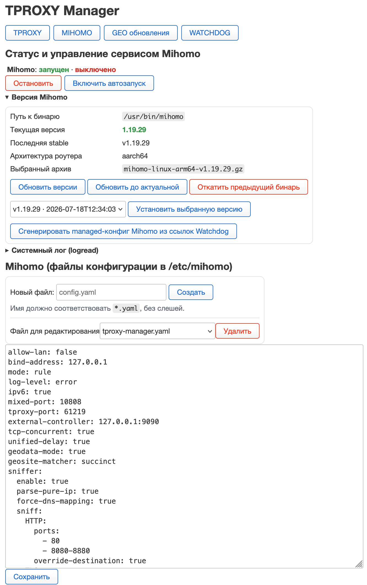

The `MIHOMO` tab works with the Mihomo managed config and YAML files in `/etc/mihomo`.

It provides:

- Service controls for `tproxy-manager-mihomo`.
- YAML editor.
- File creation and deletion.
- Syntax validation through the existing `mihomo` binary before saving.
- Mihomo version manager through GitHub Releases `MetaCubeX/mihomo`.
- Managed config generation from the shared Watchdog link list.

## SING-BOX

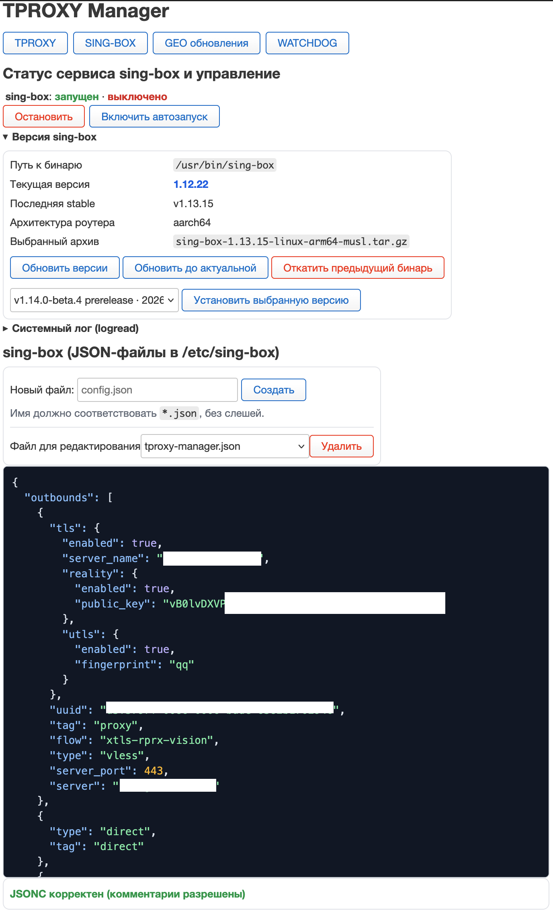

The `SING-BOX` tab works with the sing-box managed config and JSON files in `/etc/sing-box`.

It provides:

- Service controls for `tproxy-manager-sing-box`.
- Shared `logread` viewer.
- `*.json` editor for `/etc/sing-box`.
- File creation and deletion.
- JSONC editor validation and server-side validation through `sing-box check -c <tempfile>` before saving.
- sing-box version manager through GitHub Releases `SagerNet/sing-box`.
- Managed runtime config `/etc/sing-box/tproxy-manager.json`.
- Managed outbounds fragment `/etc/sing-box/tproxy-manager-outbounds.json`.

## GEO Updates

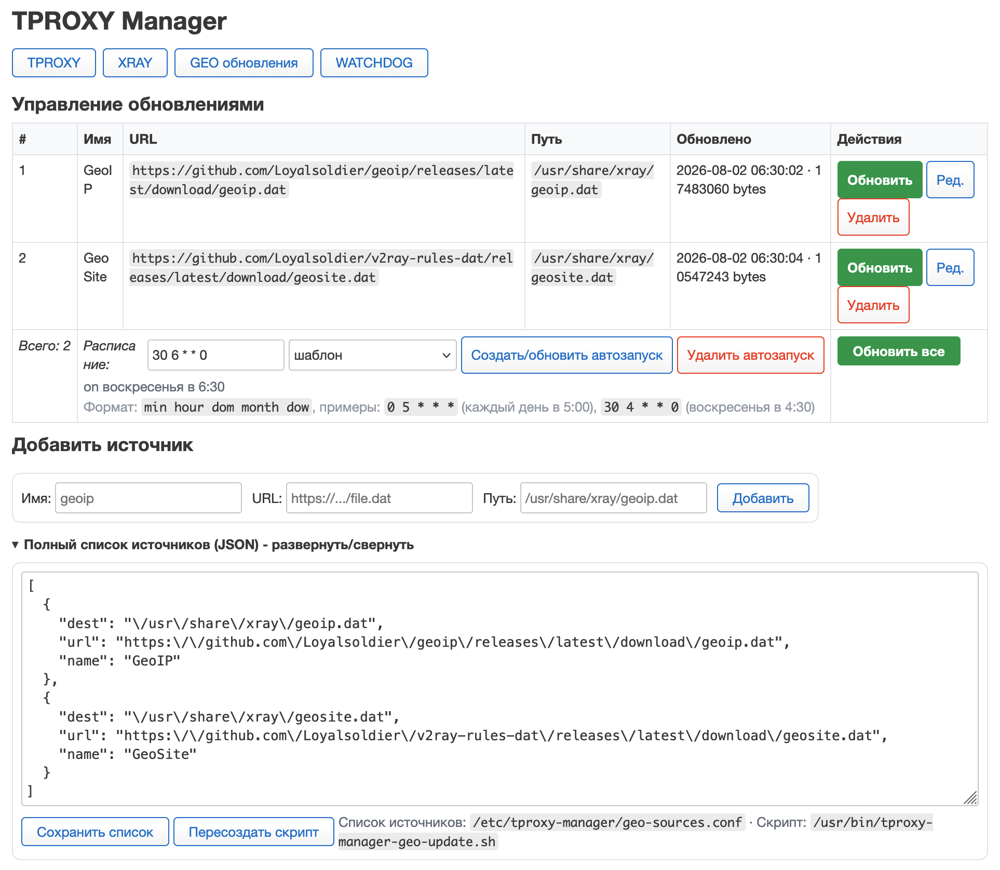

The GEO module manages:

- `/etc/tproxy-manager/geo-sources.conf`
- `/usr/bin/tproxy-manager-geo-update.sh`
- Optional cron schedule for automatic updates.

Each source contains:

- `name`
- `url`
- `dest`

Invalid JSON/JSONC is rejected server-side and never overwrites the existing source list with an empty config.

After the first update, make sure the proxy daemon uses `/usr/share/tproxy-manager/` as its GEO directory.

## WATCHDOG

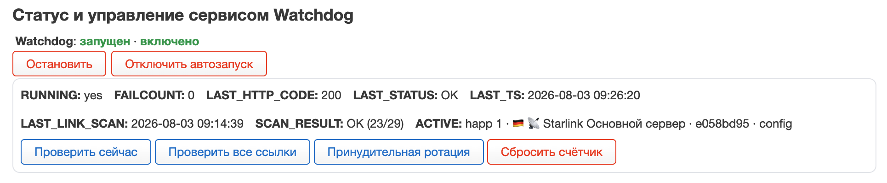

Watchdog is a separate LuCI tab and a separate OpenWrt service:

- `/etc/init.d/tproxy-manager-watchdog`
- `/usr/bin/tproxy-manager-watchdog.sh`
- `/usr/bin/tproxy-manager-subscriptions.lua`

It checks the active proxy through `CHECK_URL`. If the check fails repeatedly, Watchdog selects another proxy link, probes it with a test instance, generates an outbound config, and restarts the configured managed service.

The status line shows:

- service state;
- failure counter;
- last HTTP code;
- last check status;
- last check timestamp;
- active subscription/source when the current config matches a known link.

### Subscriptions

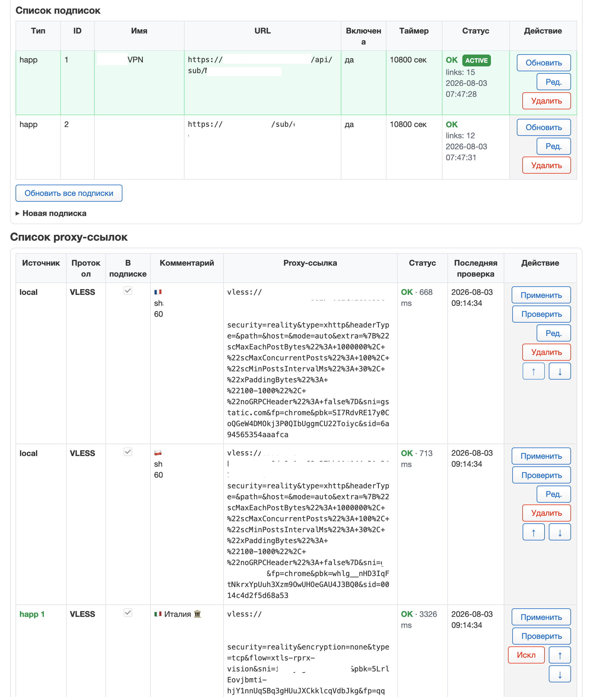

Watchdog can update the proxy list from subscriptions while preserving local links.

Supported subscription behavior:

- Happ subscriptions can use a regular `https://` URL or an encrypted `happ://crypt*` URL.
- Raw text responses are scanned for `vless://`, `hysteria2://`, and `hy2://` links.
- Base64 responses are decoded and scanned.
- Xray-like JSON responses are parsed and VLESS/Hysteria outbounds are converted to normal shareable links.

Each subscription has its own refresh timer. When a subscription changes, Watchdog updates the subscription database and synchronizes the final `watchdog.links` file. Local links are not removed.

Source labels in the link table:

- `local`: manually added link.
- `happ N`: link from Happ subscription `N`.

Subscription links are not edited directly. They can be checked, applied, excluded from rotation, moved, or restored.

### Shared Router Subscription

The `Shared router subscription` block publishes the final `watchdog.links` list as a subscription URL for other devices.

Supported clients:

- v2RayTun
- Happ
- Shadowrocket
- v2Box
- V2rayNG

The block generates two universal URLs:

- `plain`: newline-separated proxy links.
- `base64`: base64 of the same newline-separated list.

Recommended format:

- `base64`: v2RayTun, Shadowrocket, v2Box, and V2rayNG.
- `plain`: Happ and clients that accept raw proxy lists.

Sharing is disabled by default. Once enabled, URLs are public: any device that knows the URL can download the exported proxy list.

Selection modes:

- `All links`: export every valid proxy link from the current `watchdog.links`.
- `Selected links`: enable the `Shared` checkbox column in the proxy table and export only checked rows.

Links excluded from rotation are not exported because they are not part of the active `watchdog.links` file. Link health does not filter the export by itself; use selected mode when you need manual filtering.

Sharing profile file:

```txt
/etc/tproxy-manager/watchdog-share.json
```

### Happ Capture

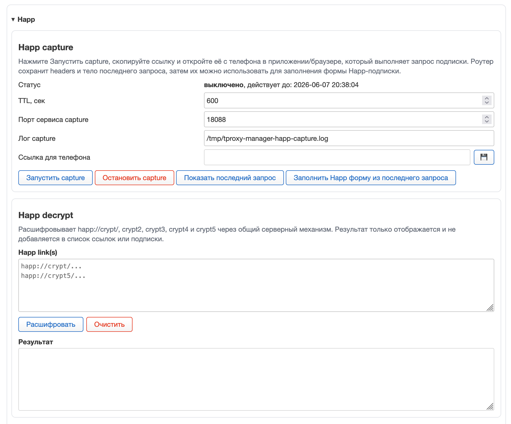

`Happ capture` is inside the shared collapsible `Happ` block. It is used to capture the real HTTP headers sent by a phone or client when requesting a subscription.

Workflow:

1. Open the `Happ` block.
2. Start capture.
3. Copy the phone link.
4. Open it on the phone in the app or browser that performs the subscription request.
5. Return to LuCI and show the last request if needed.
6. Fill the Happ form from the last request.

Capture is enabled only for a limited time. TTL, port, and log path are configured on the Watchdog tab.

### Happ Decrypt

`Happ decrypt` is in the same `Happ` block.

It decrypts:

- `happ://crypt/`
- `crypt2`
- `crypt3`
- `crypt4`
- `crypt5`

The result is displayed as plain text only. It is not added automatically to subscriptions, `watchdog.links`, or UCI because the decrypted payload may be an `https` URL, a `vless` link, JSON, or any other text.

### Link Checks And Rotation

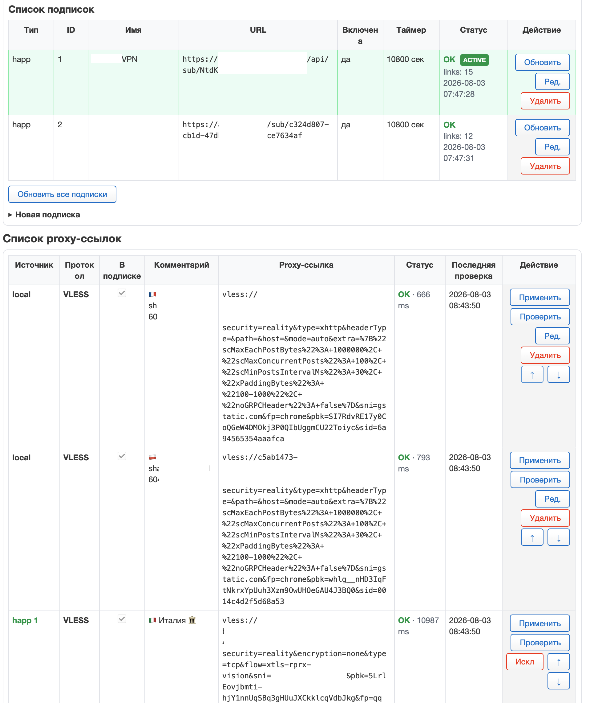

For Xray, `Check all links` uses batch mode: Watchdog creates one temporary test config for a chunk of links. Every link receives a unique outbound tag and a dedicated local SOCKS inbound, then `curl` checks `CHECK_URL` through the corresponding port. For Mihomo and sing-box, the current implementation safely falls back to individual checks.

Per-link state stores:

- `OK` or `Error`;
- last HTTP code;
- last check time;
- request time in milliseconds;
- cooldown state for dead links;
- source label and active marker.

Selection modes:

- `ordered`: cyclic order based on `watchdog.links`.
- `random`: randomized candidate order.
- `fastest`: uses alive links sorted by saved request time, with ordered fallback when no speed data exists.

For `fastest`, enable background link checks or run `Check all links` periodically so Watchdog has fresh request-time data.

### Templates

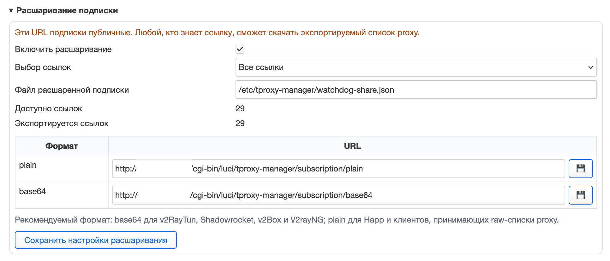

Watchdog does not embed the outbound JSON in the shell script. It uses external templates:

- `/etc/tproxy-manager/watchdog-outbound.template.jsonc`
- `/etc/tproxy-manager/watchdog-test-config.template.jsonc`
- `/etc/tproxy-manager/watchdog-batch-test-config.template.jsonc`
- `/etc/tproxy-manager/watchdog-hysteria-outbound.template.jsonc`
- `/etc/tproxy-manager/watchdog-hysteria-test-config.template.jsonc`
- `/etc/tproxy-manager/watchdog-hysteria-batch-test-config.template.jsonc`
- `/etc/tproxy-manager/watchdog-mihomo-test-config.template.yaml`
- `/etc/tproxy-manager/watchdog-mihomo-batch-test-config.template.yaml`
- `/etc/tproxy-manager/watchdog-singbox-test-config.template.jsonc`
- `/etc/tproxy-manager/watchdog-singbox-batch-test-config.template.jsonc`

The default converter is:

```sh
/usr/bin/vless2json.sh
```

Template placeholders are documented in [docs/en/vless2json.md](docs/en/vless2json.md).

## Useful Paths

| Component | Path |
| --- | --- |
| Main init.d | `/etc/init.d/tproxy-manager` |
| Main runtime | `/usr/bin/tproxy-manager.sh` |
| LuCI model | `/usr/lib/lua/luci/model/cbi/tproxy_manager/manage.lua` |
| Watchdog init.d | `/etc/init.d/tproxy-manager-watchdog` |
| Watchdog runtime | `/usr/bin/tproxy-manager-watchdog.sh` |
| Watchdog subscriptions | `/usr/bin/tproxy-manager-subscriptions.lua` |
| Xray version helper | `/usr/bin/tproxy-manager-xray-version.lua` |
| Mihomo version helper | `/usr/bin/tproxy-manager-mihomo-version.lua` |
| sing-box version helper | `/usr/bin/tproxy-manager-singbox-version.lua` |
| Watchdog libs | `/usr/libexec/tproxy-manager/watchdog/*` |
| Link converter | `/usr/bin/vless2json.sh` |
| Mihomo converter | `/usr/bin/proxy2mihomo.lua` |
| sing-box converter | `/usr/bin/proxy2singbox.lua` |
| GEO updater | `/usr/bin/tproxy-manager-geo-update.sh` |
| Main config | `/etc/config/tproxy-manager` |
| Watchdog links | `/etc/tproxy-manager/watchdog.links` |
| Watchdog subscriptions DB | `/etc/tproxy-manager/watchdog-subscriptions.json` |
| Watchdog shared subscription profile | `/etc/tproxy-manager/watchdog-share.json` |
| GEO data directory | `/usr/share/tproxy-manager` |
| Xray configs | `/etc/xray` |
| Mihomo configs | `/etc/mihomo` |
| Mihomo managed config | `/etc/mihomo/tproxy-manager.yaml` |
| Mihomo managed provider | `/etc/mihomo/tproxy-manager-proxies.yaml` |
| sing-box configs | `/etc/sing-box` |
| sing-box managed config | `/etc/sing-box/tproxy-manager.json` |
| sing-box managed outbounds | `/etc/sing-box/tproxy-manager-outbounds.json` |

## Build

The project builds packages without the OpenWrt SDK. The repository keeps separate fast builders for `.ipk` and `.apk`.

Build only `.ipk`:

```sh
./scripts/build-ipk.sh pkg/tproxy-manager dist/24.10 2026.01.01-1 ./ipkg-build
```

Build only `.apk`:

```sh
./scripts/build-apk.sh pkg/tproxy-manager dist/25.12 2026.01.01-r1 ./.apk-tools/apk.static
```

The build also compiles the bundled Russian LuCI translation catalog into:

```txt
/usr/lib/lua/luci/i18n/tproxy-manager.ru.lmo
```

## Post-Install Recommendations

### Update GEO databases

Open the GEO Updates tab and run `Update all`, or use:

```sh
/usr/bin/tproxy-manager-geo-update.sh run
```

Then configure your proxy daemon to use `/usr/share/tproxy-manager/`.

### Enable Watchdog gradually

Start with:

1. Add proxy links or a Happ subscription.
2. Run `Check all links`.
3. Apply one known-good link.
4. Enable Watchdog service.
5. Enable background checks if `fastest` mode is used.

### Run optional tuning scripts

The package includes:

```sh
/usr/bin/optimize-sysctl.sh
/usr/bin/setup-bbr.sh
```

`postinst` runs them once and does not fail package installation if they cannot apply every setting. After kernel upgrades, firmware changes, or manual sysctl edits, you can run them again:

```sh
/usr/bin/optimize-sysctl.sh
/usr/bin/setup-bbr.sh
```

`optimize-sysctl.sh` writes supported values to `/etc/sysctl.d/66-tproxy-manager.conf`.  
`setup-bbr.sh` enables TCP BBR when the kernel and `kmod-tcp-bbr` support it.

### Protect DNS from leaks

To avoid exposing DNS queries through the ISP resolver, install HTTPS DNS proxy packages:

```sh
opkg update
opkg install https-dns-proxy luci-app-https-dns-proxy luci-i18n-https-dns-proxy-ru
```

On OpenWrt 25.12:

```sh
apk update
apk add https-dns-proxy luci-app-https-dns-proxy luci-i18n-https-dns-proxy-ru
```

After installation, configure a DNS-over-HTTPS provider in LuCI and make sure LAN clients use the router as their DNS server.

## Diagnostics

Main service:

```sh
/etc/init.d/tproxy-manager status
/etc/init.d/tproxy-manager diag
logread | grep -i tproxy
```

Watchdog:

```sh
/usr/bin/tproxy-manager-watchdog.sh status
/usr/bin/tproxy-manager-watchdog.sh check-all
logread | grep -i watchdog
```

Package files:

```sh
opkg files tproxy-manager
apk info -L tproxy-manager
```
